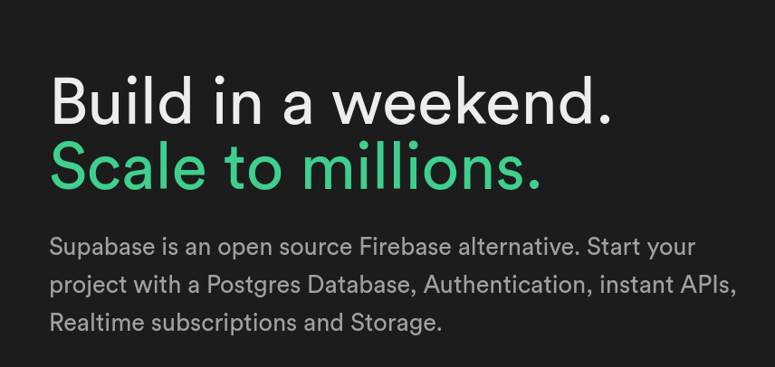
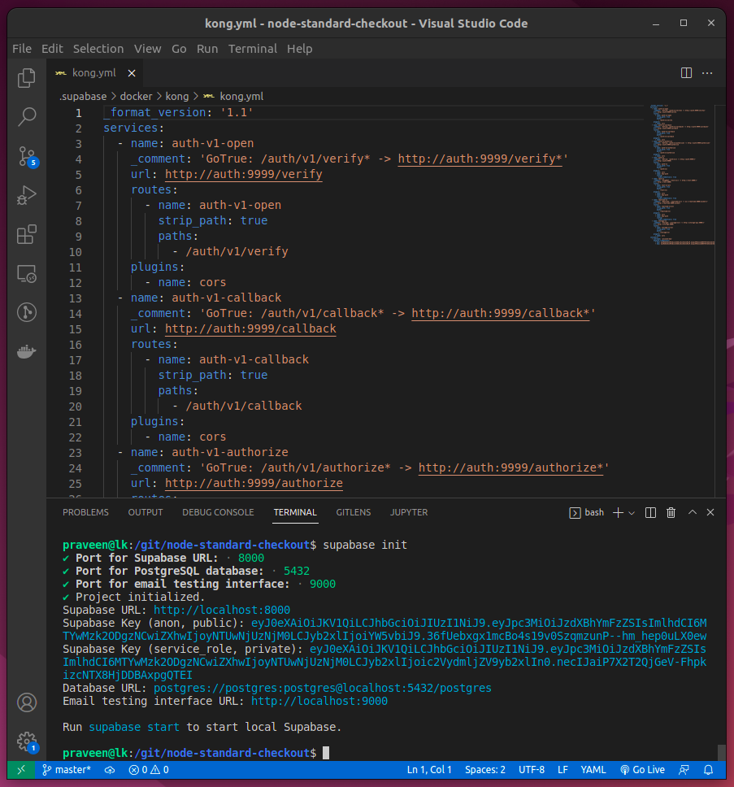
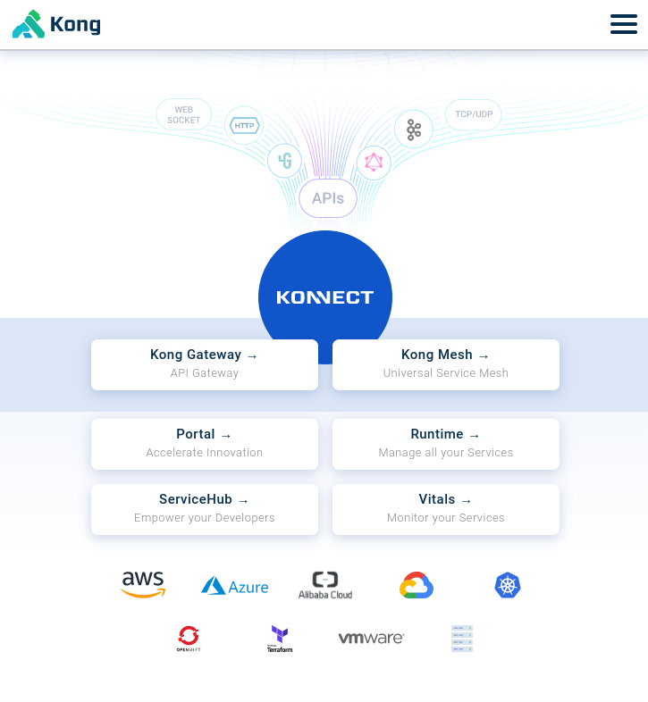
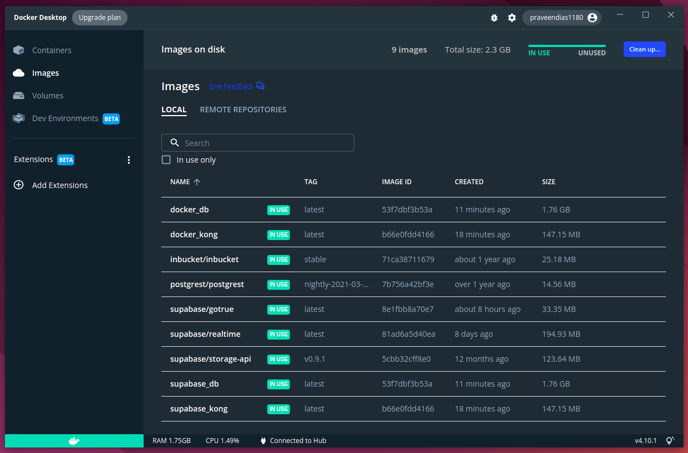
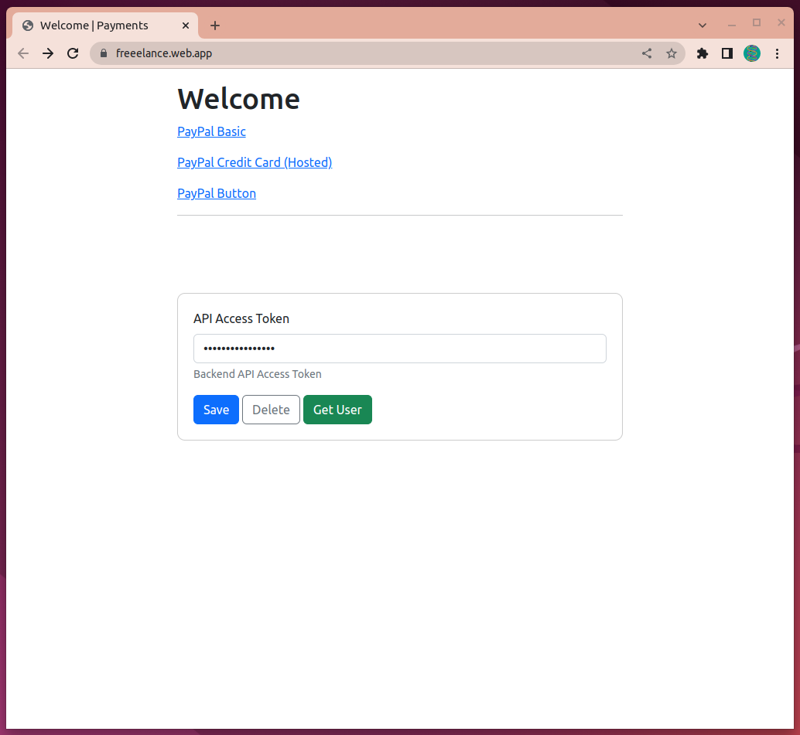
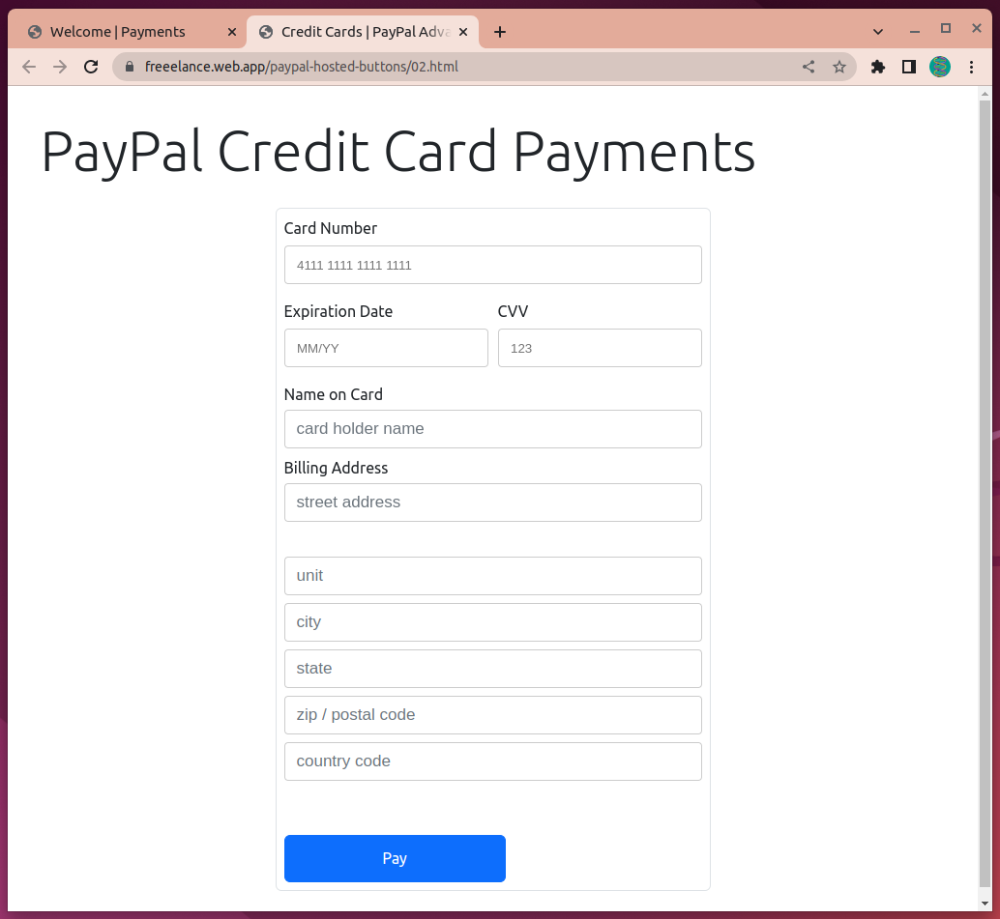
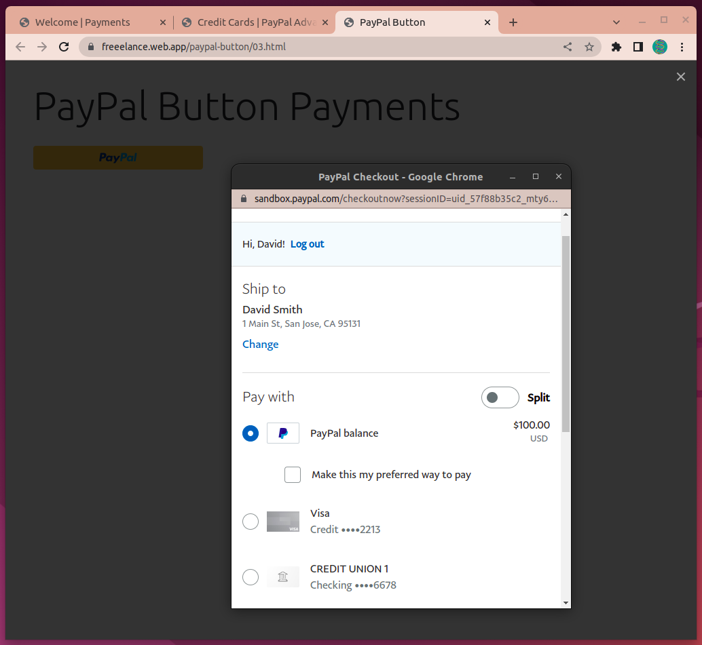
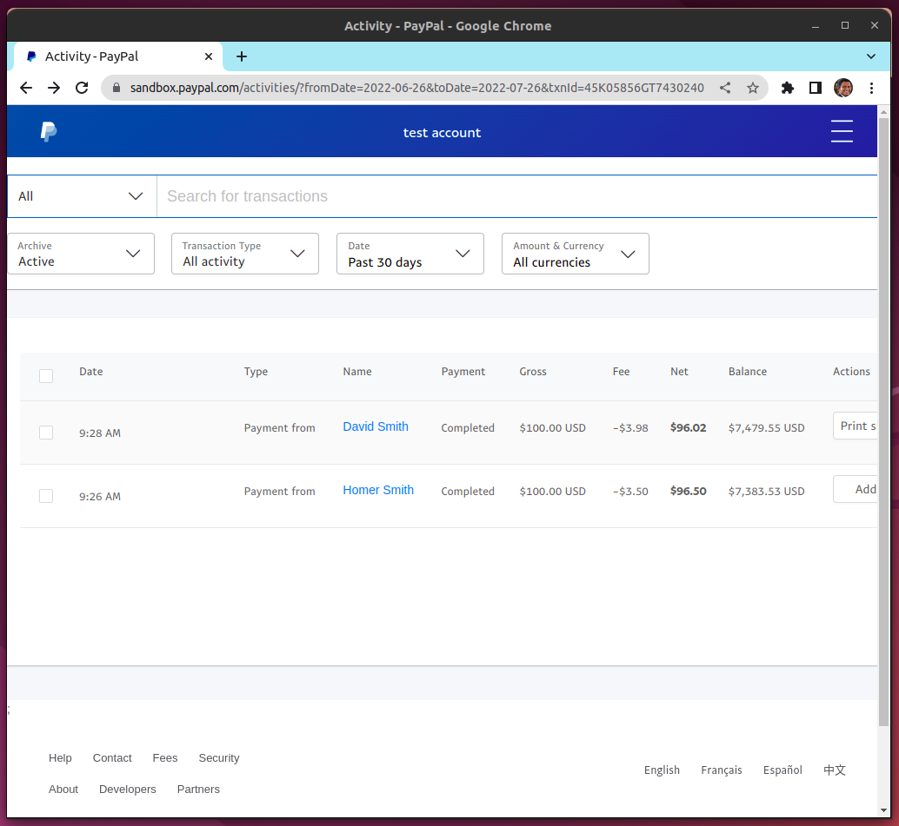
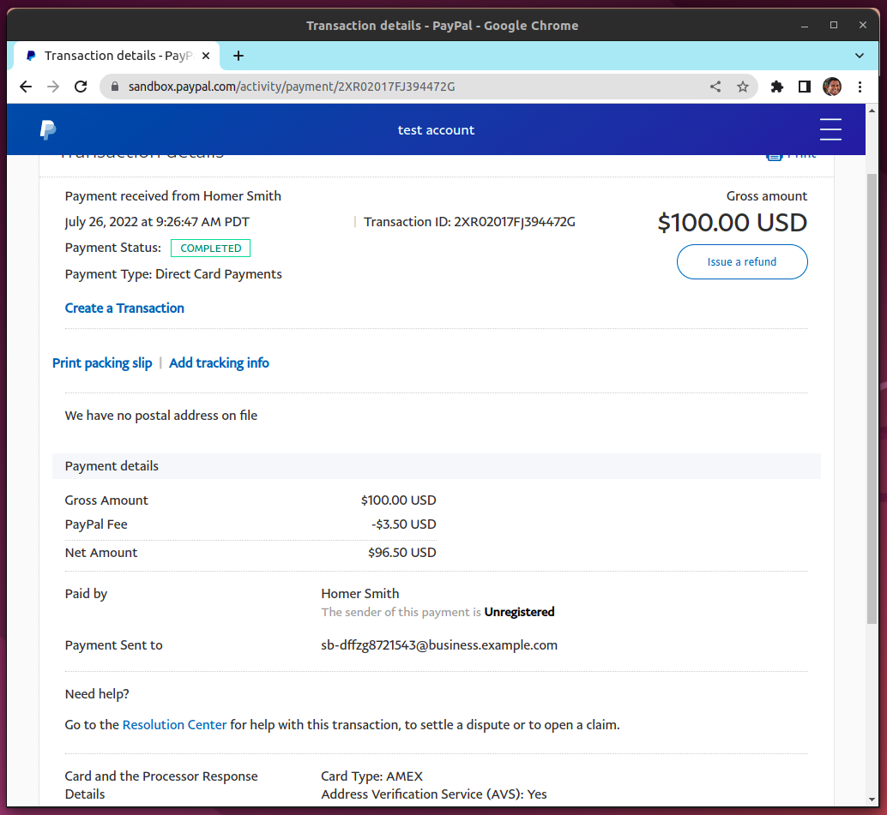

# Firebase (Frontend) + Supabase (Backend/Serverless)

The serverless backend with 'Deno' is hosted at Supabase as 'Edge Functions'. The frontend is hosted at Google Firebase.


# Supabase



# Base Commands

```
supabase init
supabase start
supabase functions new hello-world
supabase functions serve hello-world --env-file ./supabase/.env.local
cp ./supabase/.env.local ./supabase/.env
supabase secrets set --env-file ./supabase/.env
supabase secrets list
```



# KONG

https://konghq.com/



# Supabase related images



# Demo Images











# Demo Video

https://youtu.be/Y9k2KB90Te4